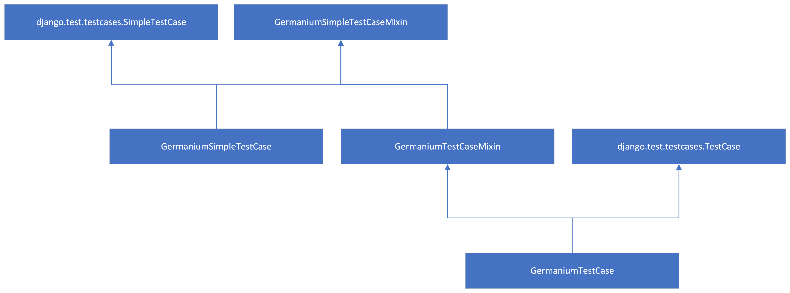

# Germanium

[](https://opensource.org/licenses/MIT)

The main reason of the library was to create wrapper over selenium framework for Django unit tests, but over time the library was changed to test utils for the standard Django unit tests.

## Installation

- Install `django-germanium` with the `pip` command:

```bash
pip install django-germanium
```

Set the germanium test runner in your settings:

```python
TEST_RUNNER = 'germanium.django.runner.GermaniumDiscoverRunner'
```

## Configuration

### Fixtures

If you want to use fixtures for the all test cases which use `GermaniumTestCase` test case you can define path to the file in your django settings with parameter:

```python
GERMANIUM_GLOBAL_FIXTURES = {
    'default': [
        os.path.join(PROJECT_DIR, 'data/common/test/init_data.json'),
    ]
}
```
The key `'default'` is name of the database which is configured in your django `DATABASES` setting.

### Multiple DB testing

Django rollbacks only primary database in `TestCase` by default. With `GermaniumTestCase` you can turn on the rollbacks on the all databases with setting:

```python
GERMANIUM_TEST_ALL_DATABASES = True
```

## Test Cases

The library provides several test cases and mixins which simplify test definitions. There are in the package `test_cases` which is divided into modules:
 * `germanium.tests_cases.default` - main Germanium test cases
 * `germanium.tests_cases.auth` - contains a test case class which can help with user authentication
 * `germanium.tests_cases.client` - test cases with methods helping with testing endpoints and web pages
 * `germanium.tests_cases.rest` - test cases with methods helping with testing REST API
 * `germanium.tests_cases.models` - depricated tests case helping with model tests
 * `germanium.tests_cases.migrations` - a migration tests case helper

### Default

Default module contains four classes with this inheritance:



#### `GermaniumSimpleTestCaseMixin` 
Upgrades test cases with test all database helper (setting `GERMANIUM_TEST_ALL_DATABASES`) and methods `set_up_class`, `tear_down_class`, `set_up`, `tear_down` which is the same as original methods `setUpClass`, `tearDownClass`, `setUp`, `tearDown` but in the camel case format.

Germanium defines django signals in the module `germanium.signals`. These signals are automatically triggered in the corresponding method `setUpClass`, `tearDownClass`, `setUp` or `tearDown`:

```python
set_up_class = Signal()
tear_down_class = Signal()
set_up = Signal()
tear_down = Signal()
```

#### `GermaniumTestCaseMixin` 

The mixin only adds ability to use `GERMANIUM_FIXTURES` setting.

#### `GermaniumTestCase` and `GermaniumSimpleTestCase`

Classes are only connection of mixins and django test cases. No new functionality are added. `GermaniumTestCase` should be used for transaction tests and `GermaniumSimpleTestCase` for non transaction tests.

### Auth

Module implements only one mixin `AuthTestCaseMixin` and helper proxy object `UserProxy` which may help to write tests with user login:


```python
from germanium.test_cases.auth import AuthTestCaseMixin
from germanium.test_cases.default import GermaniumTestCase
from germanium.tools import assert_true
from germanium.decorators import login

class TestCaseWithLogin(AuthTestCaseMixin, GermaniumTestCase):

    def get_user(self):
        # create your test user
        return UserProxy(username='test', password='test', user=User.objects.create(username='test', password='test'))
        
    def authorize(self, username, password):
        # your authorization implementation
        ...

    def logout(self):
        # your logout implementation
        ...

    @login
    def test_logged_user(self):
        assert_true(self.logged_user.user.is_authenticated)

```

As you can see in the example you should implement three methods:
* `logout` - for example logout user via REST API
* `authorize` - login user (API or standard django login helper)
* `get_user` - create user and return it in the `UserProxy` proxy object with its username and password

Finally, you can use `@login` decorator to run test with a logged user.

### Client

`ClientTestCase` and `SimpleClientTestCase` are Germanium tests cases with methods for testing HTTP resources. These test cases inherits `AuthTestCaseMixin` too and implements authorize and logout methods. The methods for testing HTTP requests are:
 
* `get(url, headers=None)` - sends the GET HTTP requests to `url` with headers `headers` and return response
* `put(url, data={}, headers={})` - sends the PUT HTTP requests to `url` with data `data` and headers `headers` and return response
* `post(url, data={}, headers={})` - sends the POST HTTP requests to `url` with data `data` and headers `headers` and return response
* `head(url, headers=None)` - sends the HEAD HTTP requests to `url` with headers `headers` and return response
* `options(url, headers=None)` - sends the OPTIONS HTTP requests to `url` with headers `headers` and return response
* `delete(url, headers={})` - sends the DELETE HTTP requests to `url` with headers `headers` and return response

### Rest

Rest module is very similar to client module. Its purpose is to test REST API. There are the same test helpers as in the Client test cases and two new helpers:

* `deserialize(resp, content_type)` - deserialize the response to the base python data types according to content type.
* `serialize(data, content_type)` - serialize data to the format for API request.

Only JSON serialized is implemented by default. You can add your serializer and deserializer into test case properties `SERIALIZERS` and `DESERIALIZERS`.

### Migrations

Test case `MigrationTestCase` in migrations module help can help with migrations testing. You have to only define properties `migrate_from` and `migrate_to`. Migrations between `migrate_from` and `migrate_to` of the app where is the test case stored are tested:

```python
from germanium.test_cases.migrations import MigrationTestCase

class YourMigrationTestCase(MigrationTestCase):

    migration_from = '0001_migration'
    migration_to = '0010_migration'
```

## Tools

Germanium adds tools helping with testing. It is similar to the nose.tools module which provides a number of testing aids that you may find useful, including decorators for restricting test execution time and testing for exceptions, and all of the same assertX methods found in unittest.TestCase (only spelled in PEP 8#function-names fashion, so assert_equal rather than assertEqual).

### Trivials

#### fail

Fail defines a bad test branch which process cannot achieve:

```python
    from germanium.tools import fail

    def test_with_fail(self):
        if term_should_not_be_true:
            fail('optional fail message')
```

#### assert_not_raises

A context manager similar to `assert_raises` but you want to test that an exception should not be raised:

```python
    from germanium.tools import assert_not_raises

    def test_assert_not_raises(self):
        with assert_not_raises(SomeException):
            code_should_not_raise_some_exception()
```

#### assert_length_equal

An assert testing if iterable len has expected number of elements.

```python
    from germanium.tools import assert_length_equal

    def test_assert_length_equal(self):
        assert_length_equal([1, 2], 2, 'optional fail message')
```

#### all_eq_obj, not_none_eq_obj

Helper singletons which can be used for comparing two elements (for example dicts) where matching some value is not required:

```python
    from germanium.tools import all_eq_obj, not_none_eq_obj, assert_equal, assert_not_equal

    def test_matching_signletons(self):
        assert_equal({'a': 5, 'b': 6}, {'a': 5, 'b': all_eq_obj})
        assert_equal({'a': 5, 'b': None}, {'a': 5, 'b': all_eq_obj})
        assert_not_equal({'a': 5}, {'a': 5, 'b': all_eq_obj})
        assert_not_equal({'a': 8, 'b': None}, {'a': 5, 'b': all_eq_obj})
        assert_not_equal({'a': 5, 'b': None}, {'a': 5, 'b': not_none_eq_obj})
        assert_equal({'a': 5, 'b': 6}, {'a': 5, 'b': not_none_eq_obj})
```

### Http

Http tools adds asserts for testing requests and responses:

* `assert_http_ok(resp, msg=None)` - test if the response code is 200
* `assert_http_created(resp, msg=None)` - test if the response code is 201
* `assert_http_accepted(resp, msg=None)` - test if the response code is 202 or 204
* `assert_http_multiple_choices(resp, msg=None)` - test if the response code is 300
* `assert_http_redirect(resp, msg=None)` - test if the response code is 302
* `assert_http_see_other(resp, msg=None)` - test if the response code is 303
* `assert_http_not_modified(resp, msg=None)` - test if the response code is 304
* `assert_http_bad_request(resp, msg=None)` - test if the response code is 400
* `assert_http_unauthorized(resp, msg=None)` - test if the response code is 401
* `assert_http_forbidden(resp, msg=None)` - test if the response code is 403
* `assert_http_not_found(resp, msg=None)` - test if the response code is 404
* `assert_http_method_not_allowed(resp, msg=None)` - test if the response code is 405
* `assert_http_conflict(resp, msg=None)` - test if the response code is 409
* `assert_http_gone(resp, msg=None)` - test if the response code is 410
* `assert_http_unprocessable_entity(resp, msg=None)` - test if the response code is 422
* `assert_http_too_many_requests(resp, msg=None)` - test if the response code is 429
* `assert_http_application_error(resp, msg=None)` - test if the response code is 500
* `assert_http_not_implemented(resp, msg=None)` - test if the response code is 501
* `assert_http_bad_gateway(resp, msg=None)` - test if the response code is 502
* `assert_http_service_unavailable(resp, msg=None)` - test if the response code is 503
* `assert_http_gateway_timeout(resp, msg=None)` - test if the response code is 504

### Rest

Rest asserts to test response:

* `assert_valid_JSON(data, msg=None)` - data is valid JSON string
* `assert_valid_JSON_response(resp, msg=None)` - the response content is valid JSON
* `assert_valid_JSON_created_response(resp, msg=None)` - the response content is valid JSON and its status code is 201
* `assert_keys(data, expected, msg=None)` - the assert ensures that the keys of the `data` match up to the keys of `expected`.

### Models

Helpers for testing django models:

* `get_pks(iterable)` - return list of models pk from iterable
* `assert_iterable_equal(first, second, msg=None)` - two iterable objects are equal with no matter on its order
* `assert_qs_exists(qs, msg=None)` - a queryset is not empty
* `assert_qs_not_exists(qs, msg=None)` - a queryset is empty  
* `assert_qs_contains(qs, obj, msg=None)` - a queryset contains the object
* `assert_qs_not_contains(qs, obj, msg=None)` - a queryset does not contains the object
* `assert_equal_model_fields(instance, refresh_from_db=False, **field_values)` - an instance fields are properly set. Value `refresh_from_db` defines if object should be reloaded from the DB. Usage: `assert_equal_model_fields(user, username='test, email='test@email.cz')`
* `assert_num_queries(num, func=None, *args, using=DEFAULT_DB_ALIAS, clear_content_type_cache=False)` - context processors for testing right number of DB queries in test:

```python
    from germanium.tools import assert_num_queries

    def test_assert_num_queries(self):
        with assert_num_queries(10, clear_content_type_cache=True):
            function_which_perform_10_queries()
```

Helper `assert_num_queries` check if function provides exactly 10 DB queries. Parameter `clear_content_type_cache` defines if Django content type cache should be cleaned before testing.


### Django

Helpers related to Django framework:

### test_call_command

Helper for testing django commands. Command stdout and stderr are sent to `/dev/null`

```python
    from germanium.tools import test_call_command

    def test_command(self):
        test_call_command('some_commmand')
```

### capture_commit_callbacks

It is impossible to test Django on commit in the standard Django transaction test cases because a database doesn't commit data to prevent mutual influence of the tests. For this purpose you can use this context processor:

```python
    from germanium.tools import capture_commit_callbacks
    from django.db import transaction

    def test_command(self):
        with capture_commit_callbacks(execute_on_commit=True):
            transaction.on_commit(do_something)
        assert_true(do_something.was_called)
```

If you are using `django-chamber` pre commit signal can be triggered with the context processor to with parameter `execute_pre_commit=True`.

For the cases when function defined in on_commit signal (`do_something`) will init another `on_commit` signal, you can use `execute_on_commit_cascade=True` to call signal in cascade.

## Crawler

Crawler is class which can help with automatic testing of your web page. It browses your web pages from index and searching for bad responses. You can use it in your tests or as a simple script:

```python
    from django.test.client import Client
    from germanium.crawler import Crawler, LinkExtractor
    
    def pre_request(url, referer, headers):
        """request changer"""
        return url, headers

    def post_response(url, referer, resp, exception):
        """response checker"""
        your_response_check(resp)


    Crawler(Client(), ('/',), self.get_exlude_urls(), pre_request, post_response).run()
```

## Test decorators

There are several test decorators which you can use to write shorter and more readable tests.

### Login

Decorators `@login` and `@login_all` can be used with `AuthTestCaseMixin` to simplify user login. The decorator `@login` is used in a single test:

```python
from germanium.decorators import login

class TestCaseWithLogin(AuthTestCaseMixin, GermaniumTestCase):

    @login
    def test_logged_user(self):
        assert_true(self.logged_user.user.is_authenticated)
```

`@login_all` is used for the test case and it is only shortcut which adds `@login` to all tests in the test case.

```python
from germanium.decorators import login_all

@login_all
class TestCaseWithLogin(AuthTestCaseMixin, GermaniumTestCase):
    
    def test_logged_user(self):
        assert_true(self.logged_user.user.is_authenticated)
```

### Data provider and data consumers

Data providers and consumers are a test technique which splits test data preparation and test logics. Data consumer can be simply use to runt test with some test data:


```python
from germanium.decorators import data_consumer

class DataConsumerTestCase(GermaniumTestCase):
    
    @data_consumer([1, 2, 3], _output_name='number')
    def test_data_consumer(self, number):
        assert_true(number in {1, 2, 3})
```

The test `test_data_consumer` will be processed three times for number 1, 2 and 3. Number will be send as test input parameter defined in property `_output_name`.

You can use more data providers for one test:

```python
from germanium.decorators import data_consumer

class DataConsumerTestCase(GermaniumTestCase):
    
    @data_consumer([1, 2], _output_name='number_a')
    @data_consumer([3, 4], _output_name='number_b')
    def test_data_consumer(self, number_a, number_b):
        assert_true(number_a in {1, 2})
        assert_true(number_b in {3, 4})
```

In this case the test will be called four times with inputs (1, 3), (1, 4), (2, 3) and (2, 4). 

You can define more parameters in one data consumer to achieve the same result:

```python
    @data_consumer([(1, 3), (1, 4), (2, 3), (2, 3)], _output_name=['number_a', 'number_b'])
    def test_data_consumer(self, number_a, number_b):
        assert_true(number_a in {1, 2})
        assert_true(number_b in {3, 4})
```

Input data can be get from test case property too:

```python
from germanium.decorators import data_consumer

class DataConsumerTestCase(GermaniumTestCase)

    test_data = [(1, 3), (1, 4), (2, 3), (2, 3)]

    @data_consumer('test_data', _output_name=['number_a', 'number_b'])
    def test_data_consumer(self, number_a, number_b):
        assert_true(number_a in {1, 2})
        assert_true(number_b in {3, 4})
```

Sometimes you want to create dynamically data in a function:

```python
def get_test_data():
    for i in range(10):
        yield i

class DataConsumerTestCase(GermaniumTestCase)

    @data_consumer(get_test_data, _output_name='number')
    def test_data_consumer(self, number):
        assert_true(number_a < 10)
```

or as a test case method:

```python
class DataConsumerTestCase(GermaniumTestCase)

    def get_test_data(self):
        for i in range(10):
            yield i

    @data_consumer('get_test_data', _output_name='number')
    def test_data_consumer(self, number):
        assert_true(number < 10)
```

For more complex data preparation you can use `@data_provider`:

```python
from germanium.decorators import data_provider

@data_provider(name='number')
def get_test_data():
    return list(range(10))

class DataConsumerTestCase(GermaniumTestCase)

    @data_consumer(get_test_data)
    def test_data_consumer(self, number):
        assert_true(number < 10)
```

The parameter `_output_name` should not be defined because the name is defined in the data provider decorator. But you can rename for the test if you want:

```python
@data_provider(name='number')
def get_test_data():
    return list(range(10))

class DataConsumerTestCase(GermaniumTestCase)

    @data_consumer(get_test_data, _output_name='number_b')
    def test_data_consumer(self, number_b):
        assert_true(number_b < 10)
```

You can return more named data in the data provider. Not all must be used in the test:

```python
from germanium.decorators import NamedTestData

@data_provider
def get_test_data():
    return NamedTestData(a=1, b=2, c=3)

class DataConsumerTestCase(GermaniumTestCase)

    @data_consumer(get_test_data)
    def test_data_consumer(self, a, b):
        assert_equal(a, 1)
        assert_equal(b, 2)
```

If you rename data provider output name only first value from named data can be used:

```python
@data_provider
def get_test_data():
    return NamedTestData(a=1, b=2, c=3)

class DataConsumerTestCase(GermaniumTestCase)

    @data_consumer(get_test_data, _output_name='d')
    def test_data_consumer(self, d):
        assert_equal(d, 1)
```

The output data of one data provider can be used in the second data provider:

```python
@data_provider(name='a')
def get_test_data_a():
    return 1

@data_provider(name='b')
def get_test_data_b(a):
    return a + 1

class DataConsumerTestCase(GermaniumTestCase)

    @data_consumer(get_test_data_a)
    @data_consumer(get_test_data_b)
    def test_data_consumer(self, a, b):
        assert_equal(a, 1)
        assert_equal(b, 2)
```

You can define static input for the data provider:

```python
from germanium.decorators import NamedDataSource

@data_provider(name='b')
def get_test_data_b(d):
    return d + 1

class DataConsumerTestCase(GermaniumTestCase)

    @data_consumer(get_test_data_b, d=5)
    def test_data_consumer(self, b):
        assert_equal(b, 6)
```

If you need to pass data to second data provider which input does not have the same name, you can use `NamedDataSource`:

```python
from germanium.decorators import NamedDataSource

@data_provider(name='a')
def get_test_data_a():
    return 1

@data_provider(name='b')
def get_test_data_b(d):
    return d + 1

class DataConsumerTestCase(GermaniumTestCase)

    @data_consumer(get_test_data_a)
    @data_consumer(get_test_data_b, d=NamedDataSource('a'))
    def test_data_consumer(self, a, b):
        assert_equal(a, 1)
        assert_equal(b, 2)
```

If you are using django tests and data provider generates data in database the rollback is used after test tear down, therefore every test run has the clean data.

## Storage

The Django storage defines where the files will be stored and how. For test purposes is better not to store file on disk but keep them in the memory to avoid tests influencing. Class `TestInMemoryStorage` can be used for these purposes. You only have to use `GermaniumTestCase` because storage uses Germanium set up and tear down signals. Storage you can define in your django settings (for test purposes):

```python
DEFAULT_FILE_STORAGE = 'germanium.storage.TestInMemoryStorage'
```
